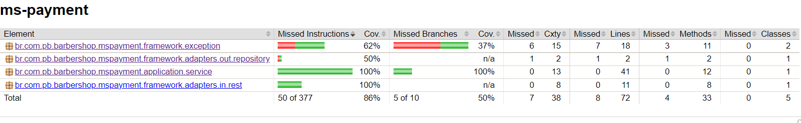
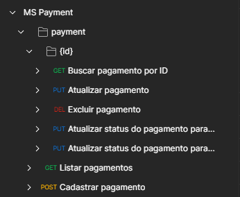

# MS Payment

- URL: http://localhost:8083/api/barbershop/payment
- [Swagger - OpenAPI](https://github.com/pbBarbershop/ms-user/blob/master/src/main/resources/openapi.yaml)
- MySQL Workbench
- [Dockerfile](https://github.com/pbBarbershop/ms-user/blob/master/Dockerfile)





## Exemplo de cURL

### POST - Cadastrar Pagamento

`/payment/:id`

```cURL
curl --location --request GET 'http://localhost:8083/api/barbershop/payment/-23969361' \
--header 'Accept: */*' \
--header 'Content-Type: text/plain' \
--data-raw '{
  "customerName": "asd",
  "paymentType": "dasdasd",
  "value": 15
}'
```

### GET - Listar Pagamentos

`/payment?status=PAYMENT_CONFIRMED`

```cURL
curl --location --request GET 'http://localhost:8083/api/barbershop/payment?status=PAYMENT_CONFIRMED' \
--header 'Accept: */*' \
--header 'Content-Type: application/json'
```

### GET - Listar Pagamento

`/payment/:id`

```cURL
curl --location --request GET 'http://localhost:8083/api/barbershop/payment/-23969361' \
--header 'Accept: */*'
```

### DEL - Excluir Pagamento

`/payment/:id`

```cURL
curl --location --request DELETE 'http://localhost:8083/api/barbershop/payment/-23969361' \
--header 'Accept: */*'
```

### PUT - Atualizar status do pagamento para cancelado

`/payment/:id/cancel`

```cURL
curl --location --request PUT 'http://localhost:8083/api/barbershop/payment/-23969361/cancel' \
--header 'Accept: */*'
```

### PUT - Atualizar status do pagamento para confirmado

`/payment/:id/confirm`

```cURL
curl --location --request PUT 'http://localhost:8083/api/barbershop/payment/-23969361/confirm' \
--header 'Accept: */*'
```

### PUT - Atualizar Pagamento

`/payment/:id`

```cURL
curl --location --request PUT 'http://localhost:8083/api/barbershop/payment/-23969361' \
--header 'Content-Type: application/json' \
--header 'Accept: */*' \
--data-raw '{
  "customerName": "ÓZKtU ÁQôaH",
  "paymentType": "Ut ipsum fugiat nisi",
  "value": -1169807.7908700407
}'
```
